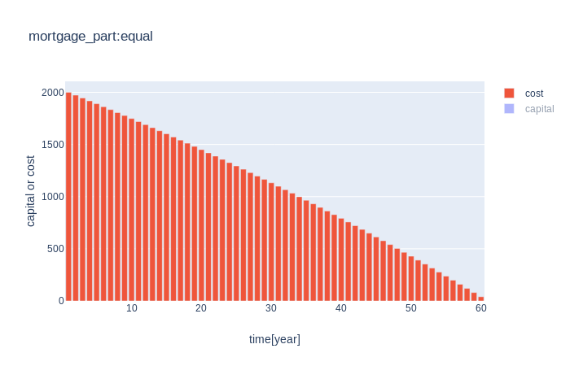

### What's this?
[Kraków 09.2019]
There are steps which I took to choose flat & mortgage loan.
It might be helpfull if you are about to buy a real estate.

#### Steps
##### Apartment selection
    //TODO 

##### Negociation
Recommended:
* book: **"Negocjuj"** Wojciech Woźniczka, **http://negocjujizwyciezaj.pl/**
* podcast: **https://tiny.pl/tjz6d**

##### Loan
1. Nominal interest rate
    **nominal interest rate = bank's margin + wibor**

  * *bank's margin* - constants thru loan period.
  * *wibor* (Warsaw Interbank Offer Rate)- volatile thru loan period.
    It's set by bank institutions. During a loan period bank updates wibor every 3 or 6 months.
    Exemplary, your installment value is evaluated on the base of wibor=2% but after 3 months installment
    can be a litte bit lower or higher depending on actual value of wibor.There is no limitation on this 
    coefficient. It can be 0%, 10% or -5% as well. In case of negative value, bank just takes it as 0% of course.
    The good news is that thru the recent 10 year, it hasn't risen to much. Moreover, probably by the 2021 wibor will have been
    changed and another benchmark will be applied. More here https://tiny.pl/tjz36
    
  * *const* on the market there are some bank which offers constatns nominal interest rate.
    That means the loan period wibor is frozen and its initial value is taken from the day you sign agreement to you bank.
    
    __Conclusions:__
    Always take a look on bank's margin.

2. Installment
  * *equal*
    Thru entire loan period your installment value is equal, that's mean you pay the same amount of many each month.
    In case of option with floating nominal interest rate(wibor), bank updates installment every 3/6 months
    przez cały okres kredytu płacisz równe raty tj. w tej samej kwocie co miesiąc.
    An installment value is set by equation: https://tiny.pl/tj3h3
  * *decreasing*
    In this case a value of the very first installment is sum of capital to be pay(amount of credit) and nomianl interes from capital to be pay.
    After each month capital to be pay is decreasing so bank's interes also and as a result you pay less installment each month
    
    Let's check how some coefficients influence on mortgage cost.
    Simulation carrid out by using python script calc.py. 
    Another ReadMe.md attached to script tells you how to use it.
    ```
    '-l',       '--loan',                  "Amount of credit [ex. 300000]"
    '-bi',      '--bank_interest',         "Bank interest [ex. 2%]"
    '-w'        '--wibor'                  "Warsaw Interbank Offered Rate [ex. 2%]"
    '-y'        '--loan_diuration'         "A loan duration [ex. 20 year]"
    '-it'       '--installment_type'       "An installement type [equal/decreasing]"
    ```
    | Installment equal [ python3 calc.py -l 300000 -bi 5 -w 3 -y 5 -it equal ] |          |
    | ------------------------------------------------------------              | -------- |
    |                           | <sup>installment value</sup> |
    |                       | <sup>installments sum</sup> |
    |                                       | <sup>only cost value</sup> |
    |                                   | <sup>cost value sum</sup>  |
    | 64975                                                        | <sup>entire cost</sup>  |
    | **On each 1 borrowed unit you will pay 1,21 unit**           | <sup>conclusion</sup>  |
    
    | Installment equal [ python3 calc.py -l 300000 -bi 5 -w 3 -y 5 -it equal ] |          |
    | ------------------------------------------------------------              | -------- |
    |                           | <sup>installment value</sup> |
    |                       | <sup>installments sum</sup> |
    |                                       | <sup>only cost value</sup> |
    |                                   | <sup>cost value sum</sup>  |
    | 59000                                                          | <sup>entire cost</sup>  |
    | **On each 1 borrowed unit you will pay 1,19 unit**             | <sup>conclusion</sup>  |
    
    |  <sup>Installment [ python3 calc.py -l 300000 -bi 5 -w 3 -y 20 -it equal ] </sup> |  |
    | ------------------------------------------------------------                      | -------- |
    | equal| <sup>**On each 1 borrowed unit you will pay 1,79 unit**</sup>              ||
    | decreasing| <sup>**On each 1 borrowed unit you will pay 2 unit**</sup>            ||
    
    __Conclusions:__
    It would be better to take decreasing installment for as short period as possible.
    
3. Overpayment
    //TODO:

4. Additional cost. Directly linked to loan
  * bank's interest for granding the loan
    Additional bank's income for the fact it borrows you many. 
    You pay it once. Some bank doesn't take it.
  * real estate appraisal (about 400zl)
    If its possible, get such appraisal from a guy which is not delegated by bank.
  * temporary insurance
    Increased nominal interest rate by the time bank will be written in land and mortgage register.
  * real estate insurance
  * life insurance 
    pay attention to it. Don't save money for that.
  * unemployment insurance
    if required, get as chap as possible
  * additional costs 
    like bank account, credit card etc.
    
    __Conclusions:__
    Pay attention to additional loan costs.
    
5. Additional cost. Not directly linked to loan (secondary market)
    * PCC 2% 
    * agent 2% (you can negotiate)
    * notary (max 1010zl + 0,4% above 60 000zl)
      often agent office has discount so it souldn't take more than 1500zł 
    * court fees (<1000) 
    
6. What amount of credit shoud I take?
  * rule 30/20/20
    30 - installment max 30% your month income
    20 - own contribution min. 20%  
    20 - load period max 20 
    
5. Buffer
    You shoud have additional bank account where 3x installment is always kept.