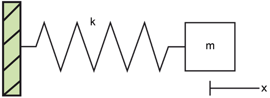
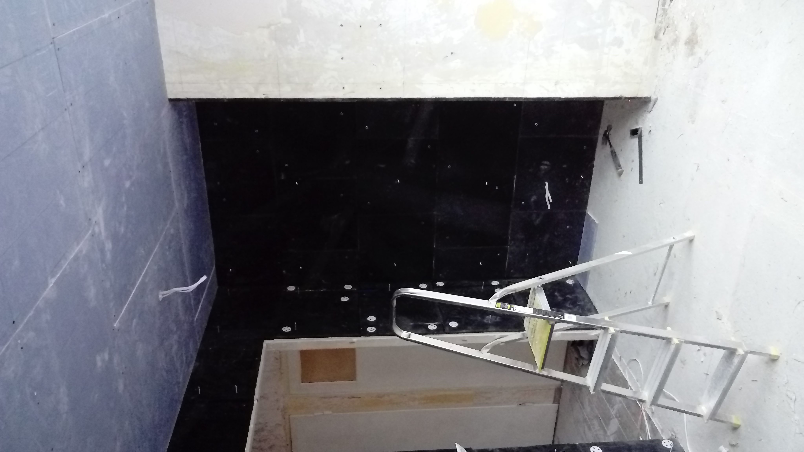
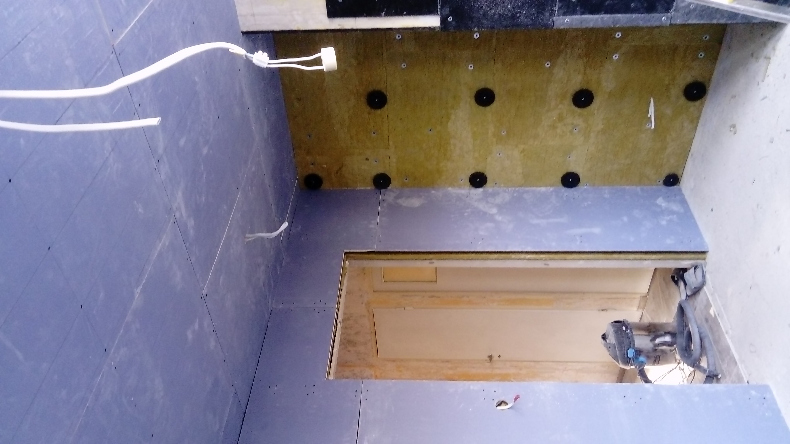
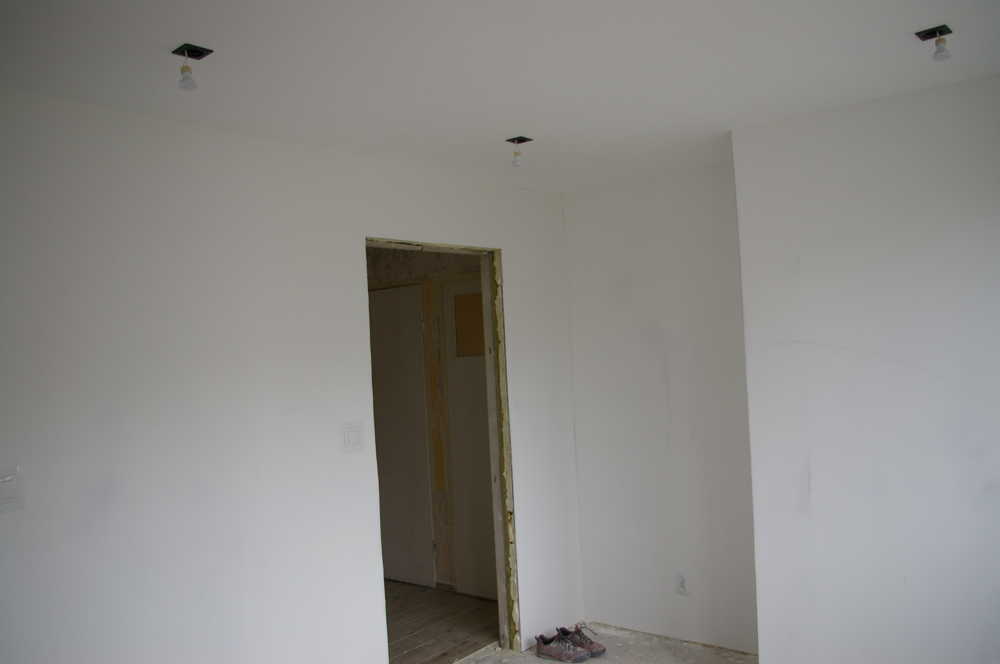
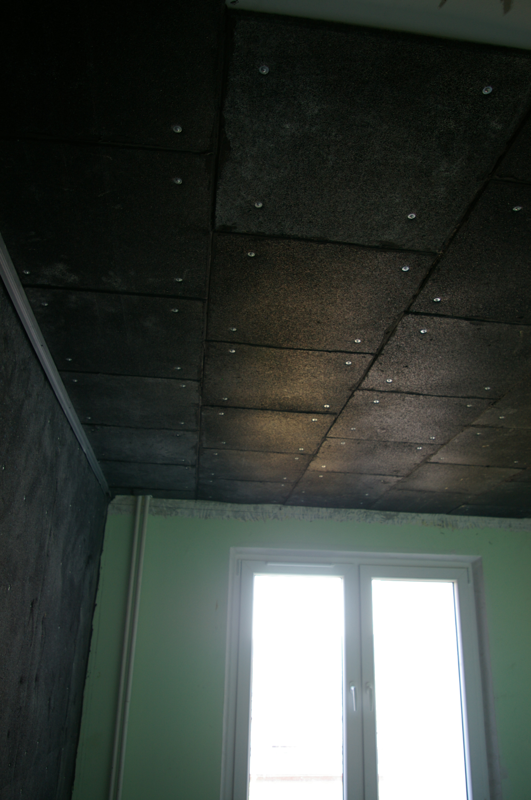

**Post ten ma na celu pomoc w doborze materiałów jak i konstrukcji dla osób planujących wykonanie izloacji akustycznej.**

## Sytacja:
Kupiłem mieszkanie do generalnego remontu w jednym z krakowskich bloków z wielkiej płyty. Lata 80-te. Jak większość nie zwróciłem uwagi na akustyke.
Przewinąłem się podczas studiów i pracy przez co najmniej 10 mieszkan w większości z wielkiej płyty i nigdy nie było problemu z akustyką. 
Po zakupie okazało się, że nademną mieszka 2+2.
Dzwięki powietrzne są wyraźne. Bardzo wyraźne. Z łatwością jestem wstanie zrozumieć że Madzia z Piotrusiem jeśli się nie uspokoją to nie pojadą jutro na działke.
I do tego dzwięki uderzeniowe. W tygodniu od 16 do 20 w weekend bez przerwy, no chyba że pojechali na działke.
A tu próbka tłuczenia niedzielnego kotleta przez sąsiada:

<!-- blank line -->
<figure class="video_container">
  <video controls="true" allowfullscreen="true" poster="DSC_0025.JPG">
    <source src="MOV_0031.mp4" type="video/mp4" >
  </video>
</figure>
<!-- blank line -->

Najgorsza jest codzienność tego stanu i brak kontroli nad tym. 
Psychika nakręca się, wyostrza do tego stopnia że po 2 msc mieszkania obudziłem się rano z powodu byle szmeru z ciśnienim jakbym własnie przebiegł 100m i się zatrzymał.
To chyba sugerowało nerwice.
Z tego co patrzylem sąsiad mial w pokojach deskie barlinecką a w kuchni i korytarzu płytki. 
Zwróciłem mu jedynie uwage że wszystko słychać. Nie chcialem robić wojny, zresztą problemem była konstrukcja budynku nie zaś sposób urzytkowania.
Wyprowadziłem się. 
Przeglądałem dostępne materiały w sieci, profesjonalne szkolenia, amerykańskie poradniki - w końcu tam się robi lekkie domki z drewna więc muszą sobie z tym radzić jakoś.
Nie  wyglądało to obiecująco. Większość porad brzmi :
*niech sąsiad zrobi podłoge pływającą/kup stopery/wyprowadź się*. 
Tym gorzej, że to były porady espertów budowlanych.
Co gorsza znalazło się pare opinii osób ktore wykonały izolacje i twierdzili że nic się nie poprawilo.
Były nawet że się pogorszyło:

>  Ewa1313
Trochę poźno znalazlam ten post, ale chciałam napisać, żeby nie korzystać z usług firmy xyz. Tragedia! Robili mi sufit. Teraz chłopaka z gory słyszę jeszcze bardziej niż słyszalam. Mam teraz pudło rezonansowe - pusty bęben. 
Nie śpię w domu już od póltora roku. Tak mi typki zmaścili sufit.  
https://tiny.pl/79h4z

A te które raportowane były jako sukces brzmiały:

>  Kolega mojego męża polecił nam panele zyx których sam używał. Razem z moim mężczyzną powiesliliśmy na ścianach i wkońcu mamy spokoj

Brakowało tylko klasyki *"Sąsiedzi go znienawidzą. Znalazł sposób na hałasy.."*
xD

## Decyzja:
Postanowilem spróbować zrobić izolacje akustyczną a w międzyczasie sprawdzać jak wygląda sprzedaż mieszkania co dopiero zakupionego z punktu widzenia banku i ewentualnch podatków które musaiłbym odprowadzić.

### Teoria:
https://www.youtube.com/watch?v=t8WGBlVI5A4
https://www.paroc.pl/knowhow/akustyka/izolacyjnosc-akustyczna

Teoria mówi: najlepiej izoluje albo masa albo konstrukcja masa-sprężyna-masa.

 - Masa czyli stropy, ścianki działowe powinny mieć wielokrotnie zwiększoną mase
	> Prawo nazwane nazwiskiem Bergera (dys. 1911).  To prawo stanowi, że w przypadku pionowego wejścia dźwięku skuteczność izolacji akustycznej jednowarstwowej ściany zwiększa się o 6 dB w przypadku podwojenia jej masy.
	
	A więc rozwiązaie niepraktyczne.

 - Masa spreżyna masa. Czyli odpowiednio dobrane materiały ułożone w warstwy typu "sandwich". Takie coś działa jak mechaniczny filtr dolnoprzepustowy.
   Można nawet określić jego częstotliwość graniczną. Im niższa tym lepiej
   

     
   m,k - masa, współczynnik sprężystości. Ściana/wełna skalna/K-G
   Dlatego użyty K-G powinien mieć większą mase niż zwykły K-G. A najlepiej stosować podwójne płyty.

W praktyce jak to było pokazane na filmiku, dzwięk kiedy dostanie się do konstrukcji budynku roznosi się poprzez drgania w całej objętości budynku. 
Dlatego jak sugerowali wcześniej, to podłoga pływająca jest najlepszym i najtańszym miejscem odcięcia drgań, bo izoluje u źródła.

### Ograniczenia
Do tego dochodzą ograniczenia prawa budowlanego + wymysły samej spółdzielni co wolno a czego nie wolno robić.
>  W zakresie wykoniania podwieszanego sufitu w pokojach budunków mieszkalnych, łazienkach.. , należy zachować minimlną wysokość 2.5m zgodnie z $72 ust.1 oraz $77 ust 2 Rozporzącdzenia Ministra Infrastruktury z 12.04.2002

Podobnie ze ścianiami których nie można pogrubić gdyż zabrania się zmiany powierzchni użytkowej.
Niestety nie było pola manewru. Blok ma wysokość pomieszczeń 2.5m a izolacja ścian musi zmiejszyć troche powierzchni użytkowej.

### Co zrobiłem
Zastosowałem przedścianki typu sandwich na najcieńsze ściany (tj ścian działowe) i na sufit.

#### pokój 1 (12m2)
materiał:
- guma sbr 800kg/m3. 50cmx50cm grubość 15mm. Tylko ściany
- wełna skalna rockwool steprock hd 140kg/m3. Grubość 5cm na sufit/2cm ściany
- płyty K-G Norgips acustic. 11.5kg/m2 
- mocowanie ściany:Atlas m-system / sufit:profile ud27 ,cd 60
- wieszaki ES z dorabianą podkładką antywibracyjną
- sufit druga płyta KG 8mm
- pianka poliuretanowa

#### pokój 1 (9m2)
materiał:
- guma sbr 800kg/m3. 50cmx50cm grubość 15mm. Ściay i sufit
- wełna skalna rockwool steprock hd 140kg/m3. Grubość 3cm na sufit. 3-5cm ściany.
- płyty K-G Norgips acustic. 11.5kg/m2 
- profile ud27 ,cd 60
- wieszaki ES z podkładką antywibracyjną
- taśma obwodowa stywall

## Efekt
Dźwięki powietrzne
- od sąsiada z góry bardzo mocno zredukowane. Jeśli ktoś krzyczy lub głośno mówi to da się to stwierdzić ale nie da się wyłapać żadnych słów. Stan OK.
- od sądiada z dołu troche bardziej słyszalne. Położenie paneli z podkładem powinno to jeszcze zredukować. Stan OK.

Dźwięki uderzeniowe
- od sąsiada z góry stłumione ale odczuwalne jesli ktoś biega. Słychać tylko basy. W porównaniu ze stanem wyjściowym, jest lepiej. Jednak izolacja nie radzi sobie 
  z tym tak dobrze jak z dźwiękami powietrznymi. 
